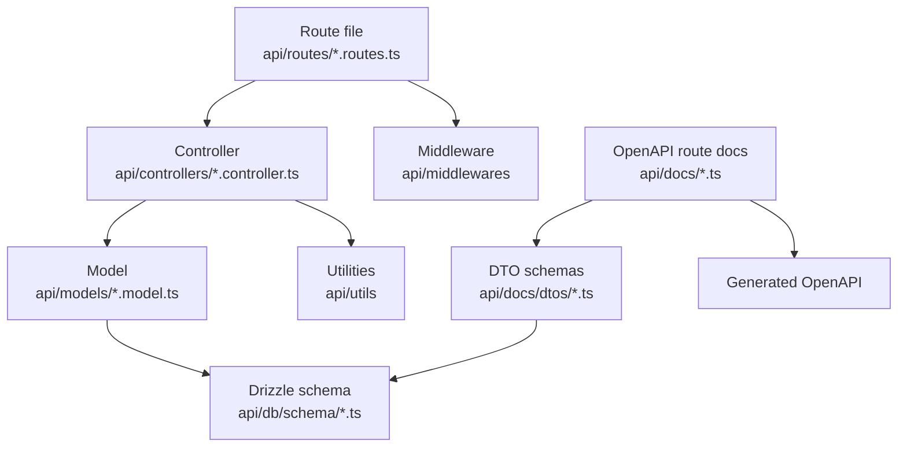

Sawa's backend is organized by responsibility. A feature usually crosses several files, but each file type has a different job.

## What belongs where

| Layer | Belongs here | Does not belong here |
| --- | --- | --- |
| Routes | URL shape, HTTP method, route-level middleware, controller selection, nested routers. | Business rules, database queries, response formatting. |
| Controllers | Request parsing, validation orchestration, calling models/services, choosing response status and response body. | Raw SQL-heavy persistence patterns that should be reusable. |
| Models | Drizzle queries, inserts, updates, deletes, reusable data access by domain. | Express `Request` or `Response` objects. |
| Schema | Tables, columns, relations, constraints, inferred insert/select schemas. | Request-specific DTO decisions or HTTP concerns. |
| Docs DTOs | Public request/response shapes for OpenAPI and mobile codegen. | Private database fields that should not be client-visible. |
| Docs route files | `registerPath` metadata for methods, params, bodies, responses, tags, and auth. | Runtime behavior. |

## Example: places

`api/routes/places.routes.ts` defines `/places`, applies `mediaHandler` for multipart upload, and delegates to `createPlaceController`. The controller parses multipart fields, validates category/activity/place input, calls models such as `createPlace`, `createCategory`, and `createPlaceMedia`, then returns the HTTP response.

The OpenAPI side is separate: `api/docs/places.ts` describes the public route, while `api/docs/dtos/places.ts` describes public request and response shapes.

<Tip>
  If you are not sure where code belongs, ask whether the code needs Express objects, database access, or public API metadata. That usually tells you the layer.
</Tip>
