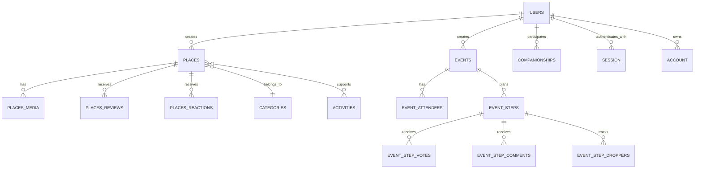

Sawa's database model is organized around users, places, social activity planning, and lookup taxonomy.

## Domain groups

- Identity: `users` plus Better Auth `session`, `account`, and `verification` tables.
- Places: places, media, reviews, reactions, categories, activities, and place-activity links.
- Events: event plans, attendees, steps, votes, comments, droppers, and step users.
- Companionships: companions, companionships, statuses, filters, and status changelog.
- Taxonomy: categories, category types, activities, media types, genders, and reaction types.

<Note>
  Liam ERD can generate a deeper table-level view from the Drizzle schema when you need implementation detail.
</Note>
