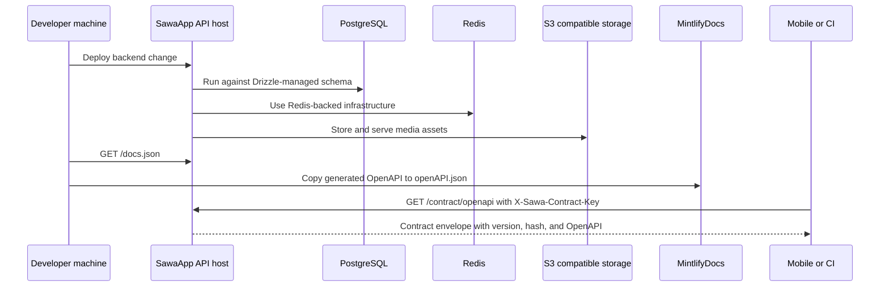

Sawa has three important surfaces: the backend API, generated API documentation, and contract consumers such as mobile or CI.

## Operational surfaces

- Local development runs `npm run dev` and reads local `.env`.
- The backend exposes `/health`, `/docs`, `/docs.json`, `/api/auth/*`, app routes, `/contract/*`, and `/liam/*`.
- Mintlify reads a copied `openAPI.json` for generated API reference.
- Mobile and CI read `/contract/openapi` with `X-Sawa-Contract-Key`.

<Warning>
  Keep docs publishing and API deployment separate. Updating docs does not deploy backend behavior; updating backend routes requires regenerating OpenAPI for docs to reflect the new contract.
</Warning>
