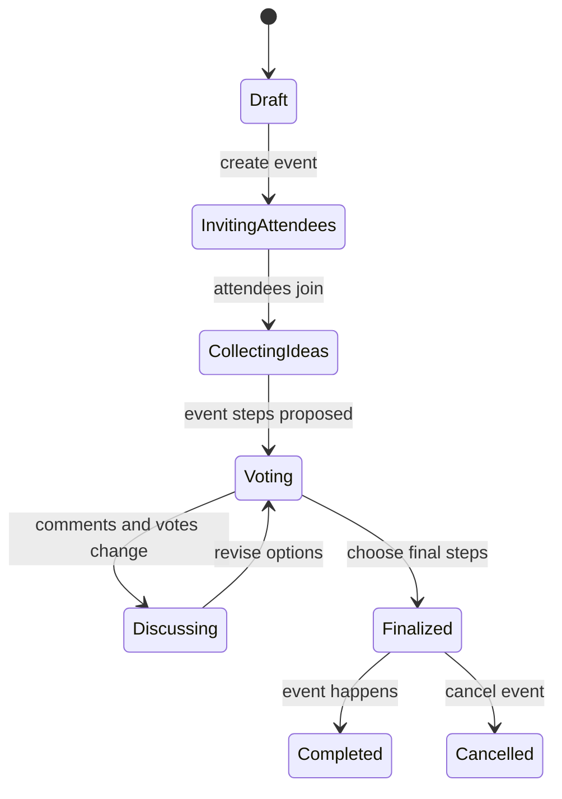

Events let users plan a shared activity itinerary. The data model supports attendees, candidate steps, voting, comments, dropper tracking, and final selected steps.

## Tables involved

- `events`: the event shell and owner-facing metadata.
- `eventAttendees`: users invited to or participating in the event.
- `eventSteps`: candidate or selected itinerary steps.
- `eventStepVotes`: votes on event steps.
- `eventStepComments`: discussion around options.
- `eventStepDroppers`: users who drop from a step.
- `eventStepUsers`: users connected to a step.

## Why this matters

Leadership can read events as the core collaboration workflow. Developers should read events as a multi-table domain: changing one endpoint often touches event status, attendee permissions, and step-level side effects.
