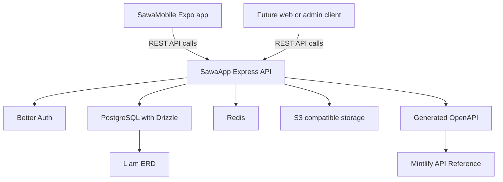

Sawa's backend is an Express API written in TypeScript. It uses Better Auth for `/api/auth/*`, Drizzle with PostgreSQL for persistence, Redis for infrastructure needs, S3-compatible storage for media, and generated OpenAPI for the API reference and mobile contract.

## Current docs boundary

The first migration phase documents the backend and generated API reference. Mobile and UX docs are reserved for later phases, with the backend side of the mobile contract documented now.
