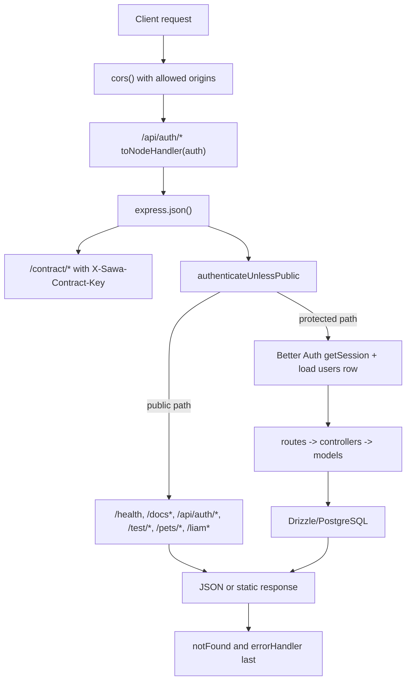

Middleware order matters in `SawaApp/api/server.ts`.

## Important order

- CORS runs before auth.
- Better Auth mounts before `express.json()`.
- `/contract/*` mounts before session middleware.
- `authenticateUnlessPublic` globally protects app routes.
- `notFound` and `errorHandler` run after route registration.
